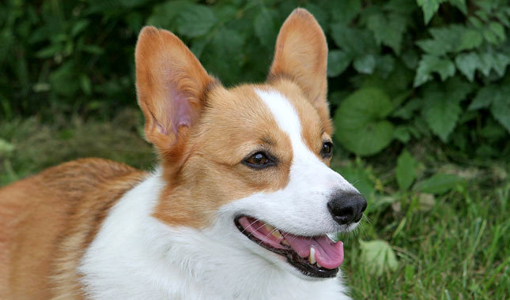
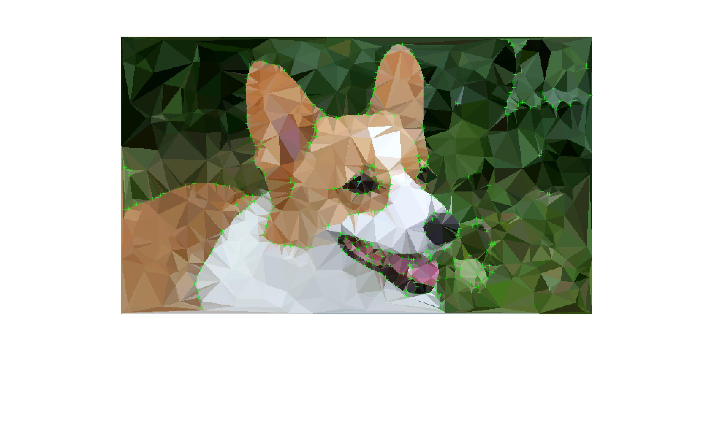
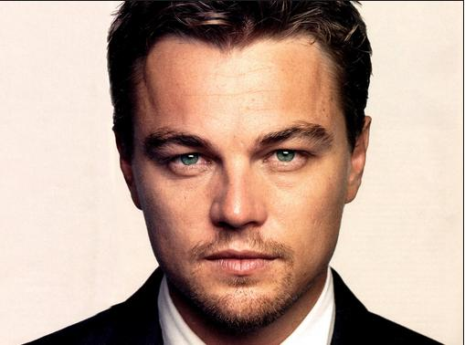
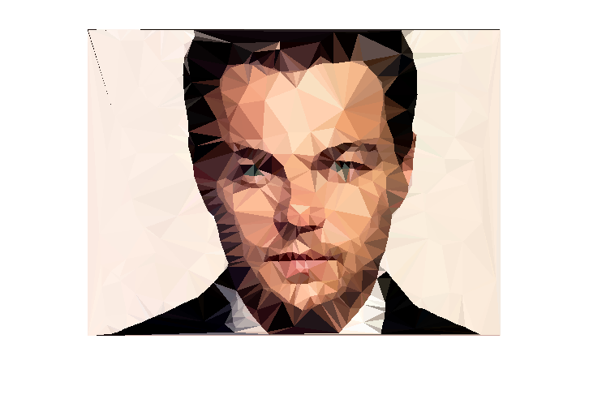
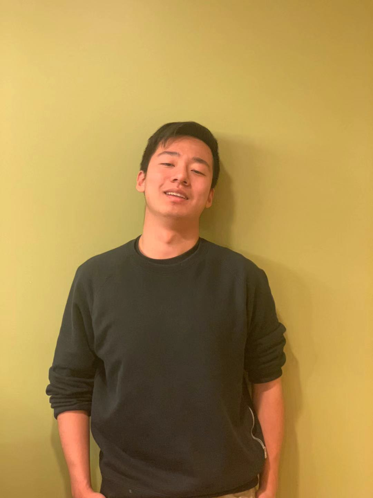
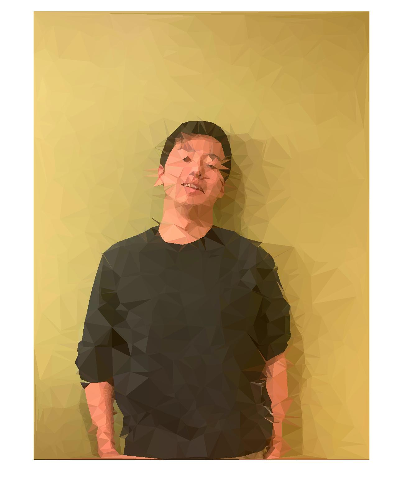

# LowPolyHack

## Getting Started
Transfer image into low poly

Run:
```MATLAB
lp_img = lowpolify(file,edge_thresh,edge_style,...
    num_vertices,ratio,min_distance, FeatureRatio)
```
to generate low poly pictures

### Some results

Original                   |  Low polified
:-------------------------:|:-------------------------:
    |  
    |  
    |  


## Steps to get Low Poly style

### Reduce noise:
    Why: Noise will affect edge detection. Since we are reducing the precision and the level of details in the image, we want the edge lines to be as clean and simple as possible.
```
    Averaging: Good for removing grain noise (bad)
    Gaussian filters
```
### Edge detection

```
    Sobel (worse than Canny)
    Canny
    Prewitt
    Roberts
    log
    zerocross (explore)
```
### Feature extraction

It is necessary to perserve the features of the original picture.

We used Harris Features detector to achieve feature extractions (As you can see in the green crosses)

### trianglization and color

We used Delaunay triangulation to form the triangle.
The color of the center pixel of each trangle is picked, the mean or mode color will not perserve the feature correctly


## Built With

* [Dropwizard](http://www.dropwizard.io/1.0.2/docs/) - The web framework used
* [Maven](https://maven.apache.org/) - Dependency Management
* [ROME](https://rometools.github.io/rome/) - Used to generate RSS Feeds

## Contributing

Please read [CONTRIBUTING.md](https://gist.github.com/PurpleBooth/b24679402957c63ec426) for details on our code of conduct, and the process for submitting pull requests to us.

## Authors

* **Yuke Liang** - *Initial work* - [LowPolyHack](URL)
* **Yudong Huang** - *Initial work* - [LowPolyHack](URL)
* **Zhaoning Wang** - *Initial work* - [LowPolyHack](URL)

